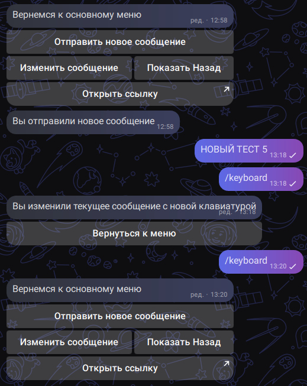

# Maxgram
v0.1.3 от 29.03.2025

Python клиент (неофициальный) для [API MAX](https://dev.max.ru/)

Внимание! Разработка в ранней стадии. Сейчас поддерживаются: прием и отправка сообщений, инлайн-клавиатура.

> Обсудить в [MAX DevChat](https://max.ru/join/xzUCRiPjt_G7EaLtKLe7PgT69GPRP51BHHEv7n5W7J0) - комьюнити разработчиков ботов и приложений MAX


## Быстрый старт

### 1. Установка
```sh
pip install maxgram
```

### 2. Получение токена
Откройте диалог с [MasterBot](https://max.ru/masterbot), следуйте инструкциям и создайте нового бота. После создания бота MasterBot отправит вам токен. Используйте его в коде ниже вместо YOUR_BOT_TOKEN

### 3. Пример эхо-бота
```python
from maxgram import Bot

# Инициализация бота
bot = Bot("YOUR_BOT_TOKEN")

# Обработчик события запуска бота
@bot.on("bot_started")
def on_start(context):
    context.reply("Привет! Отправь мне ping, чтобы сыграть в пинг-понг или скажи /hello")

# Обработчик для сообщения с текстом 'ping'
@bot.hears("ping")
def ping_handler(context):
    context.reply("pong")

# Обработчик команды '/hello'
@bot.command("hello")
def hello_handler(context):
    context.reply("world")

# Обработчик для всех остальных входящих сообщений
@bot.on("message_created")
def echo(context):
    # Проверяем, что есть сообщение и тело сообщения
    if context.message and context.message.get("body") and "text" in context.message["body"]:
        # Получаем текст сообщения
        text = context.message["body"]["text"]
        
        # Проверяем, что это не команда и не специальные сообщения с обработчиками
        if not text.startswith("/") and text != "ping" and text != "hello":
            context.reply(text)

# Запуск бота
if __name__ == "__main__":
    try:
        bot.run()
    except KeyboardInterrupt:
        bot.stop()
```

### 4. Установка подсказок для команд бота

```python
# Установка команд бота
bot.set_my_commands({
    "help": "Получить помощь",
    "ping": "Проверка работы бота",
    "hello": "Приветствие"
})
```

Примечание: функционал подсказок сейчас может не работать на десктопном клиенте

### 5. Работа с клавиатурой

* Полный пример смотрите [keyboard_bot.py](https://github.com/kayumovru/maxgram/tree/master/keyboard_bot.py)



#### Создание клавиатуры

* Поддерживаются инлайн-кнопки, иимпортируйте InlineKeyboard из библиотеки
* Для формирования клавиатуры передайте списки, где каждый список - это одна строка кнопок. Внутри строки кнопок располагаются словари с названием и уникальным тегом кнопки. Callback - обычная кнопка, url - кнопка ссылка
* Количество кнопок в строке по количеству словарей. При этом ширина кнопок делится поровну
* Для отправки клавиатуры в сообщении просто передайте параметр keyboard в reply c названием клавиатуры

```python
from maxgram.keyboards import InlineKeyboard

# Создание клавиатуры
main_keyboard = InlineKeyboard(
    [
        {"text": "Отправить новое сообщение", "callback": "button1"},
    ],
    [ 
        {"text": "Изменить сообщение", "callback": "button2"},
        {"text": "Показать Назад", "callback": "button3"}
    ],
    [
        {"text": "Открыть ссылку", "url": "https://pypi.org/project/maxgram/"}
    ]
)

# Отправить клавиатуру по команде '/keyboard'
@bot.command("keyboard")
def keyboard_command(context):
    context.reply(
        "Вот клавиатура. Выбери одну из опций:",
        keyboard=main_keyboard
    )

```

#### Обработка нажатий на кнопки

* Примите уникальные теги кнопок из .payload и отвечайте с помощью .reply_callback
* Можно передавать новые клавиатуры в сообщениях
* Укажите параметр is_current=True, чтобы изменить текущее сообщение, а не отправлять новое

```python
# Обработчик нажатий на кнопки
@bot.on("message_callback")
def handle_callback(context):
    
    button = context.payload
    
    if button == "button1":
        context.reply_callback("Вы отправили новое сообщение")
    elif button == "button2":
        context.reply_callback("Вы изменили текущее сообщение", is_current=True)
    elif button == "button3":
        context.reply_callback("Вы изменили текущее сообщение с новой клавиатурой", 
                          keyboard=InlineKeyboard(
                              [{"text": "Вернуться к меню", "callback": "back_to_menu"}]
                          ),
                          is_current=True)
    elif button == "back_to_menu":
        context.reply_callback(
            "Вернемся к основному меню", 
            keyboard=main_keyboard,
            is_current=True
        )
```

## Больше документации и примеров

* (в разработке) [Документация](https://github.com/kayumovru/maxgram/tree/master/docs)

* [Примеры](https://github.com/kayumovru/maxgram/tree/master/examples)

* [Для разработчиков](https://github.com/kayumovru/maxgram/tree/master/docs_dev)